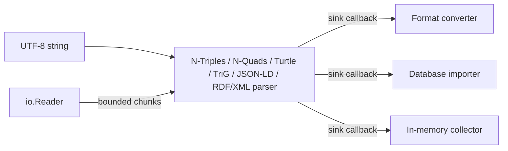

# odin-rdf

[](https://www.w3.org/TR/n-triples/)


[](LICENSE)

A small, streaming-first RDF toolkit for Odin, built around standards compliance and explicit memory ownership.

> The API may still evolve. The RDF 1.1 N-Triples, N-Quads, Turtle, and TriG parsers pass the pinned W3C suites used by this repository; JSON-LD and RDF/XML support documented to-RDF core profiles.

## Status and scope

Version `0.20.0` adds RDFC-1.0 canonical dataset hashes and collision-independent isomorphism checks for integrity, cache, and signing-protocol inputs. Version `0.19.0` adds a complete, resource-bounded implementation of W3C RDF Dataset Canonicalization 1.0 (RDFC-1.0), including SHA-256 and SHA-384 and canonical N-Quads output. Version `0.18.0` adds a stateful RDF/XML document writer for large default-graph streams, with explicit namespaces and a bounded blank-node map. Version `0.17.0` made RDF/XML a bounded, atomic conversion target for complete default graphs. Version `0.16.0` added its deterministic batch writer. Version `0.15.0` completes markup-bearing RDF/XML Literal input. Version `0.14.0` added an atomic TriG dataset formatter and `odin-rdf format` support for `.trig`. Version `0.13.0` added a streaming-safe TriG writer and loss-aware TriG conversion targets. Version `0.12.0` added bounded TriG-to-RDF dataset input with `.trig` conversion inference and an owned, capacity-bounded dataset collector. Version `0.11.0` added bounded RDF/XML-to-RDF input; the release line also includes bounded JSON-LD-to-RDF dataset processing with local contexts and opt-in document loading, a reproducible Turtle formatter benchmark, ergonomic file-format inference, bounded conversion readers, batch Turtle formatting, production-oriented RDF 1.1 N-Triples and N-Quads parsers and writers, a conformant Turtle parser and streaming-safe Turtle writer, and an RDF dataset model.

Graph storage and SPARQL are not part of the current release. JSON-LD deliberately has a narrower [to-RDF core profile](docs/jsonld-design.md) than the complete JSON-LD API. RDF/XML has bounded document input and a separate complete-graph writer plus a bounded batch conversion target, not a streaming one. Both boundaries are documented rather than silently approximated.

The project is tested with Odin `dev-2026-07` and CI tracks the current Odin toolchain on Linux, macOS, and Windows.

## Why odin-rdf?

- **Verified syntax compliance.** The pinned W3C RDF 1.1 suites cover all 72 N-Triples, 87 N-Quads, 313 Turtle, and 355 TriG cases through memory and streaming entry points. JSON-LD and RDF/XML each have documented, reproducible core selections; RDF/XML runs 173 cases. RDFC-1.0 runs all 65 official canonicalization and resource-limit cases.
- **Predictable memory use.** `io.Reader` parsing is bounded by configurable chunk and line limits; callers can also cap emitted triples.
- **Bounded documents.** JSON-LD, RDF/XML, and TriG retain one explicitly limited document; neither performs implicit network I/O.
- **Designed for pipelines.** Sink callbacks let converters, database importers, and command-line tools process triples without materializing a graph.
- **Explicit lifetimes.** Public APIs document exactly how long input-backed and decoded strings remain valid.
- **Release gates that match library risk.** CI covers three operating systems, compiler vetting, memory tracking, and AddressSanitizer.

## How it fits



## Design goals

- Treat RDF 1.1 as the stable baseline and introduce RDF 1.2 features only as explicit, experimental extensions.
- Keep parsers independent of files, in-memory graph implementations, and databases.
- Stream triples to a sink instead of requiring the entire graph to be retained in memory.
- Support chunked `io.Reader` input with configurable line and triple limits.
- Make string and allocator ownership clear at every public API boundary.
- Establish correctness with the official W3C tests before optimizing performance.
- Keep a standalone minimal example for developers who are new to Odin.

## Repository layout

```text
rdf/                 Syntax-independent RDF terms, triples, and quads
rdf/ntriples/        N-Triples parser, writer, and unit tests
rdf/nquads/          N-Quads parser, writer, and unit tests
rdf/turtle/          Turtle parser, writer, formatter, IRI resolution, and bounded reader
rdf/jsonld/          Bounded JSON-LD-to-RDF dataset processor
rdf/rdfxml/          Bounded RDF/XML processor with batch and stateful writers
rdf/trig/            Bounded RDF 1.1 TriG parser and streaming-safe writer
rdf/canon/           Resource-bounded W3C RDFC-1.0 dataset canonicalization
rdf/dataset/         Owned, capacity-bounded dataset collector
rdf/convert/         Streaming syntax-to-syntax conversion adapter
cmd/odin-rdf/        Command-line converter built on the adapter
examples/minimal/    Tiny educational example with no library dependency
examples/basic/      Streaming parser API example
examples/turtle/     Turtle directives and compact graph example
examples/turtle_writer/ Streaming Turtle-to-Turtle conversion example
examples/turtle_formatter/ Batch Turtle formatting example
examples/rdfxml_writer/ Stateful RDF/XML document writer example
examples/conversion/  Conversion with explicit reader limits
tests/w3c/           Pinned W3C conformance test runner
tests/property/      Deterministic parser/reader/writer property tests
tests/fuzz/          Reproducible differential parser fuzzing harness
benchmarks/          Reproducible parser and formatter benchmarks
```

## API overview

The complete public surface, defaults, ownership rules, error conventions, and
reader behavior are collected in the [API reference](docs/api-reference.md).

- `ntriples.parse(input, sink)` parses a complete UTF-8 document already held in memory.
- `ntriples.parse_scoped(input, sink, scope)` is an advanced syntax-integration adapter. Callers must provide a non-zero scope when parsed blank nodes need document identity.
- `ntriples.parse_reader(reader, sink, options)` parses incrementally with bounded memory. Defaults are a 64 KiB read buffer and a 16 MiB maximum line length.
- `ntriples.write_triple(builder, triple)` validates a triple and atomically appends canonical-layout N-Triples.
- `nquads.parse`, `nquads.parse_reader`, and `nquads.write_quad` provide the corresponding RDF dataset pipeline.
- `turtle.parse(input, sink, options)` covers RDF 1.1 Turtle directives, relative IRIs, compact predicate/object lists, literal shorthands, property lists, and collections.
- `turtle.parse_reader(reader, sink, options)` preserves document state across bounded chunks with configurable statement, token, prefix-count/bytes, nesting, pending-triple, and emitted-triple limits.
- `jsonld.parse(input, sink, options)` and `jsonld.parse_reader(reader, sink, options)` transform a bounded JSON-LD document into RDF quads. Remote contexts require an explicit loader callback.
- `rdfxml.parse(input, sink, options)` and `rdfxml.parse_reader(reader, sink, options)` transform a bounded RDF/XML document into default-graph RDF quads. They do not fetch external resources and preserve markup-bearing `rdf:parseType="Literal"` content as `rdf:XMLLiteral`.
- `rdfxml.write_triples(builder, triples)` atomically appends a deterministic RDF/XML document for a complete default graph. `rdfxml.init_document_writer`, `write_document_triple`, and `finish_document_writer` provide the separate stateful path for large streams with explicit root-level namespaces and a bounded blank-node map.
- `trig.parse(input, sink, options)` and `trig.parse_reader(reader, sink, options)` transform bounded RDF 1.1 TriG into default- and named-graph quads. They support directives, graph blocks, collections, and property lists.
- `trig.write_prefixes` and `trig.write_quad` atomically serialize explicit prefixes and individual dataset quads. Each named graph quad is emitted as an independent graph block, so output preserves order and stays streaming-safe without retaining a dataset.
- `trig.format_quads(builder, quads, options)` is the explicit batch path: it groups a complete dataset by graph, sorts and deduplicates quads, and can infer safe prefixes for terms and graph names.
- `canon.canonicalize(builder, quads, options)` atomically writes the W3C RDFC-1.0 canonical N-Quads form of a complete dataset. `canon.canonical_hash` produces its SHA-256 or SHA-384 hexadecimal digest, and `canon.isomorphic` compares canonical forms without relying on a digest. All three remove exact duplicate quads and enforce resource limits on input size, recursive work, and permutations.
- `dataset.Collector` copies transient quads and term strings into caller-owned storage with an optional quad admission limit. `dataset.triple_sink` adapts N-Triples and Turtle output to default-graph quads. It preserves order and duplicates; it is not a graph store.
- `turtle.write_prefixes`, `turtle.write_term`, and `turtle.write_triple` provide stable, atomic Turtle serialization with explicit prefix selection and IRIREF fallback.
- `turtle.format_triples(builder, triples, options)` produces a deterministic, grouped Turtle document from a complete triple collection. Its default policy infers safe prefixes; use `Prefix_Policy.Explicit_Only` when declarations must be caller-controlled.
- `convert.convert(reader, output, options)` connects the bounded readers and writers without retaining a graph; it rejects a named N-Quads graph when the selected output cannot represent it.
- `convert.Reader_Limits` provides one explicit source-resource policy across all conversions: record count for every syntax, physical-line bytes for N-Triples/N-Quads, top-level statement bytes for Turtle, and retained document bytes for JSON-LD/RDF/XML/TriG.
- `rdf.literal`, `rdf.language_literal`, and `rdf.typed_literal` construct literals without ambiguous language/datatype combinations.
- `rdf.validate_term_structure` and `rdf.validate_triple_structure` check syntax-independent RDF data-model invariants.
- Every public error enum has a matching stable, allocation-free message function across `rdf` and all syntax packages.

Strings passed to a sink may point into the caller's input or a temporary parser buffer. They are valid only for the duration of that callback. Copy values or encode them into application-owned IDs before returning if they need to outlive the callback.

Use `dataset.Collector` when retaining parser output is appropriate. It owns all
stored strings until `dataset.destroy` and makes the retention bound explicit:

```odin
import dataset "path/to/odin-rdf/rdf/dataset"
import trig "path/to/odin-rdf/rdf/trig"

collector: dataset.Collector
if dataset.init(&collector, {max_quads = 10_000}) != .None do return
defer dataset.destroy(&collector)

parse_error := trig.parse(input, dataset.sink, {}, &collector)
if parse_error.code == .Stopped && collector.last_error == .Quad_Limit {
    // The dataset admission limit was reached; no extra quad was retained.
}
```

RDF term constructors establish datatype invariants but intentionally leave lexical validation to format parsers and writers. Parsed blank nodes carry a non-zero document scope: repeated labels within one parse identify the same node, while equal labels from independent parser invocations do not. Manually constructed blank nodes use scope zero unless a scope is supplied.

Canonicalization is intentionally a complete-dataset operation, not a streaming
writer. It is useful for stable dataset comparison, signing pipelines, and test
fixtures. Its built-in limits reject adversarially complex blank-node graphs;
raise a specific limit only after setting an application-level admission policy.

## Getting started

Clone or vendor this repository into your Odin source tree, then import the packages by path. The basic streaming interface looks like this:

```odin
package main

import "core:fmt"
import rdf "path/to/odin-rdf/rdf"
import ntriples "path/to/odin-rdf/rdf/ntriples"

print_triple :: proc(triple: rdf.Triple, _: rawptr) -> bool {
	fmt.println(triple.subject.value, triple.predicate.value, triple.object.value)
	return true
}

main :: proc() {
	input := `<https://example.com/alice> <https://example.com/name> "Alice"@en .`
	if err := ntriples.parse(input, print_triple); err.code != .None {
		fmt.eprintf("line %d, column %d: %s\n", err.line, err.column, ntriples.parse_error_message(err.code))
	}
}
```

See [`examples/basic`](examples/basic/main.odin) for a runnable version and [`rdf/ntriples/reader.odin`](rdf/ntriples/reader.odin) for bounded-memory `io.Reader` parsing options.

For datasets, the callback receives an `rdf.Quad`; `has_graph == false` denotes the default graph without inventing a sentinel RDF term:

```odin
print_quad :: proc(quad: rdf.Quad, _: rawptr) -> bool {
	if quad.has_graph {
		fmt.println(quad.subject.value, quad.predicate.value, quad.object.value, quad.graph.value)
	} else {
		fmt.println(quad.subject.value, quad.predicate.value, quad.object.value, "(default graph)")
	}
	return true
}

err := nquads.parse(`<urn:s> <urn:p> <urn:o> <urn:g> .`, print_quad)
```

See [`examples/nquads`](examples/nquads/main.odin) for the complete runnable example.

Turtle accepts an optional initial base IRI and emits a statement only after it
has been completely validated:

```odin
import turtle "path/to/odin-rdf/rdf/turtle"

input := `@prefix ex: <https://example.com/> .
ex:alice a ex:Person ; ex:name "Alice"@en .`

err := turtle.parse(input, print_triple)
```

See [`examples/turtle`](examples/turtle/main.odin) for a complete example.

Turtle writing is streaming-safe: declare an explicit prefix table once, then
write every parsed triple directly to the destination. The writer chooses the
longest safe namespace match and otherwise preserves the IRI as `<...>`:

```odin
prefixes := []turtle.Prefix{{label = "ex", namespace = "https://example.com/"}}
options := turtle.Writer_Options{prefixes = prefixes}
turtle.write_prefixes(&builder, prefixes)
turtle.write_triple(&builder, triple, options)
```

See [`examples/turtle_writer`](examples/turtle_writer/main.odin) for a runnable
Turtle-to-Turtle streaming conversion example. It deliberately does not group
triples, infer prefixes, or reformat property lists and collections.

For a complete graph already retained by your application, use the batch
formatter instead. It sorts terms, groups repeated subjects and predicates,
uses `a` for `rdf:type`, removes exact duplicate triples, and writes only after
the entire document is valid. It does not preserve source ordering or comments:

```odin
options := turtle.Format_Options{
    prefixes = []turtle.Prefix{{label = "ex", namespace = "https://example.com/"}},
    prefix_policy = .Explicit_Only,
}
err := turtle.format_triples(&builder, triples, options)
```

See [`examples/turtle_formatter`](examples/turtle_formatter/main.odin) for a
runnable batch-formatting example.

## Command-line conversion

Build the repository command when you want a small, dependency-free conversion
tool:

```sh
odin build cmd/odin-rdf -out:odin-rdf

./odin-rdf convert input.ttl --output output.nt
./odin-rdf convert input.nt --to turtle \
  --prefix ex=https://example.com/ --output output.ttl
cat input.nq | ./odin-rdf convert - --from nquads --to nquads > output.nq
./odin-rdf format input.ttl --output formatted.ttl
./odin-rdf format input.trig --output formatted.trig --max-quads 100000
```

Supported spellings are `ntriples`/`nt`, `nquads`/`nq`, `turtle`/`ttl`,
input-only `jsonld`/`json-ld`/`json`, and
`rdfxml`/`rdf-xml`/`rdf/xml`/`rdf`/`xml`, plus `trig`. RDF/XML output is a
bounded batch target and requires `--max-records N`. For file paths, `convert` infers the
corresponding syntax from `.nt`, `.nq`, `.ttl`, `.jsonld`, `.json`, `.rdfxml`,
`.rdf`, `.xml`, or `.trig`; explicit `--from` and `--to` override that inference. `-` denotes
standard input or output and always requires the corresponding explicit format,
as do unrecognized extensions. File targets are streamed into a
same-directory temporary file and replace the destination only after the
conversion succeeds and the temporary file closes successfully. Standard output
is intentionally streaming for N-Triples, N-Quads, Turtle, and TriG, so a later
input error can leave earlier valid records on the pipe. RDF/XML is the explicit
batch exception: standard output remains empty until its bounded graph parses
and serializes successfully. Turtle and TriG prefixes are always explicit and repeatable;
use `--prefix =https://example.com/` for the default prefix.

N-Quads default-graph records convert to every available target, including
bounded RDF/XML. A named graph can target N-Quads or TriG; the command rejects every lossy target rather than
dropping the graph name.

`convert` can bound untrusted input with `--max-records N` for all source
syntaxes, `--max-line-bytes N` for N-Triples/N-Quads,
`--max-statement-bytes N` for Turtle, and `--max-document-bytes N` for JSON-LD,
RDF/XML, and TriG. RDF/XML output requires a positive `--max-records` value as
its retained-graph admission bound. These are positive decimal values. A
file target is still replaced only after the whole conversion succeeds.

`format` accepts Turtle and TriG input. It infers `.ttl` or `.trig` for file
inputs; standard input requires `--from turtle` or `--from trig`. It parses the
complete graph or dataset before writing, so neither standard output nor a
target file receives partial formatted output on a parse or serialization
error. It infers safe prefixes by default; repeat `--prefix LABEL=NAMESPACE`
to provide declarations, and pass `--no-infer-prefixes` to use only those
explicit declarations. Use `--max-triples N` for Turtle or `--max-quads N` for
TriG to enforce an explicit retention bound; `N` must be a positive decimal
integer. Peak memory also includes a sorted index and, during atomic commit,
both temporary and destination formatted output. Treat the bound as a
graph-size admission policy rather than a byte-precise memory cap. Reproduce the formatter workload in
[`benchmarks`](benchmarks/README.md) on the target machine before choosing a
production value.

The [conversion design](docs/conversion-design.md) records the conversion
matrix, error behavior, and file-output safety policy.

Error helpers follow one stable naming convention: parsers expose
`parse_error_message`, writers expose `write_error_message`, and the core model
uses a descriptive `<operation>_error_message` name. These functions are
allocation-free; callers should branch on the enum code rather than message
text.

## Verification

```sh
odin check rdf -no-entry-point
odin test rdf
odin test rdf/ntriples
odin test rdf/nquads
odin test rdf/turtle
odin test rdf/jsonld
odin test rdf/rdfxml
odin test rdf/trig
odin test rdf/canon
odin test rdf/dataset
odin test rdf/convert
odin test cmd/odin-rdf
odin test tests/property
odin run tests/fuzz -o:speed -sanitize:address
odin run examples/minimal
odin run examples/basic
odin run examples/turtle
odin run examples/turtle_writer
odin run examples/turtle_formatter
odin run examples/conversion
odin run cmd/odin-rdf -- --help
./scripts/run-w3c-tests.sh
./scripts/run-w3c-nquads-tests.sh
./scripts/run-w3c-turtle-tests.sh
./scripts/run-w3c-jsonld-tests.sh
./scripts/run-w3c-rdfxml-tests.sh
./scripts/run-w3c-trig-tests.sh
./scripts/run-w3c-rdf-canon-tests.sh
./scripts/run-benchmarks.sh
```

Maintainers should also follow the [release checklist](docs/releasing.md).
Performance comparisons use the documented [v0.4.0 baseline](benchmarks/baseline.md)
as an orientation point, never as a cross-machine claim or a hard CI threshold.

## Roadmap

1. Reassess JSON-LD output/canonicalization and storage/SPARQL APIs as separate product directions.

## License

The repository is named `odin-rdf`, while the core package is `rdf`. The project is available under the MIT License.
