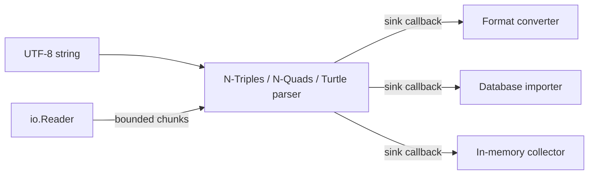

# odin-rdf

[](https://www.w3.org/TR/n-triples/)


[](LICENSE)

A small, streaming-first RDF toolkit for Odin, built around standards compliance and explicit memory ownership.

> The API may still evolve. The RDF 1.1 N-Triples, N-Quads, and Turtle parsers pass the pinned W3C suites used by this repository.

## Status and scope

Version `0.5.0` provides production-oriented RDF 1.1 N-Triples and N-Quads parsers and writers, a conformant Turtle parser and streaming-safe Turtle writer, and an RDF dataset model. The syntax packages share tested internal lexical primitives and support complete UTF-8 input, escape decoding, strict syntax validation, bounded-memory streaming, and early termination through sink callbacks.

RDF/XML, JSON-LD, graph storage, and SPARQL are not part of the current release. Turtle formatting remains separate from writing because document grouping, prefix discovery, and layout policy require a batch-oriented API.

The project is tested with Odin `dev-2026-07` and CI tracks the current Odin toolchain on Linux, macOS, and Windows.

## Why odin-rdf?

- **Verified syntax compliance.** The pinned W3C RDF 1.1 suites cover all 72 N-Triples, 87 N-Quads, and 313 Turtle cases through memory and streaming entry points. Turtle evaluation uses RDF graph isomorphism.
- **Predictable memory use.** `io.Reader` parsing is bounded by configurable chunk and line limits; callers can also cap emitted triples.
- **Designed for pipelines.** Sink callbacks let converters, database importers, and command-line tools process triples without materializing a graph.
- **Explicit lifetimes.** Public APIs document exactly how long input-backed and decoded strings remain valid.
- **Release gates that match library risk.** CI covers three operating systems, compiler vetting, memory tracking, and AddressSanitizer.

## How it fits



## Design goals

- Treat RDF 1.1 as the stable baseline and introduce RDF 1.2 features only as explicit, experimental extensions.
- Keep parsers independent of files, in-memory graph implementations, and databases.
- Stream triples to a sink instead of requiring the entire graph to be retained in memory.
- Support chunked `io.Reader` input with configurable line and triple limits.
- Make string and allocator ownership clear at every public API boundary.
- Establish correctness with the official W3C tests before optimizing performance.
- Keep a standalone minimal example for developers who are new to Odin.

## Repository layout

```text
rdf/                 Syntax-independent RDF terms, triples, and quads
rdf/ntriples/        N-Triples parser, writer, and unit tests
rdf/nquads/          N-Quads parser, writer, and unit tests
rdf/turtle/          Turtle parser, writer, IRI resolution, and bounded reader
examples/minimal/    Tiny educational example with no library dependency
examples/basic/      Streaming parser API example
examples/turtle/     Turtle directives and compact graph example
examples/turtle_writer/ Streaming Turtle-to-Turtle conversion example
tests/w3c/           Pinned W3C conformance test runner
tests/property/      Deterministic parser/reader/writer property tests
tests/fuzz/          Reproducible differential parser fuzzing harness
benchmarks/          Reproducible parser benchmarks
```

## API overview

The complete public surface, defaults, ownership rules, error conventions, and
reader behavior are collected in the [API reference](docs/api-reference.md).

- `ntriples.parse(input, sink)` parses a complete UTF-8 document already held in memory.
- `ntriples.parse_scoped(input, sink, scope)` is an advanced syntax-integration adapter. Callers must provide a non-zero scope when parsed blank nodes need document identity.
- `ntriples.parse_reader(reader, sink, options)` parses incrementally with bounded memory. Defaults are a 64 KiB read buffer and a 16 MiB maximum line length.
- `ntriples.write_triple(builder, triple)` validates a triple and atomically appends canonical-layout N-Triples.
- `nquads.parse`, `nquads.parse_reader`, and `nquads.write_quad` provide the corresponding RDF dataset pipeline.
- `turtle.parse(input, sink, options)` covers RDF 1.1 Turtle directives, relative IRIs, compact predicate/object lists, literal shorthands, property lists, and collections.
- `turtle.parse_reader(reader, sink, options)` preserves document state across bounded chunks with configurable statement, token, prefix-count/bytes, nesting, pending-triple, and emitted-triple limits.
- `turtle.write_prefixes`, `turtle.write_term`, and `turtle.write_triple` provide stable, atomic Turtle serialization with explicit prefix selection and IRIREF fallback.
- `rdf.literal`, `rdf.language_literal`, and `rdf.typed_literal` construct literals without ambiguous language/datatype combinations.
- `rdf.validate_term_structure` and `rdf.validate_triple_structure` check syntax-independent RDF data-model invariants.
- Every public error enum has a matching stable, allocation-free message function across `rdf` and all syntax packages.

Strings passed to a sink may point into the caller's input or a temporary parser buffer. They are valid only for the duration of that callback. Copy values or encode them into application-owned IDs before returning if they need to outlive the callback.

RDF term constructors establish datatype invariants but intentionally leave lexical validation to format parsers and writers. Parsed blank nodes carry a non-zero document scope: repeated labels within one parse identify the same node, while equal labels from independent parser invocations do not. Manually constructed blank nodes use scope zero unless a scope is supplied.

## Getting started

Clone or vendor this repository into your Odin source tree, then import the packages by path. The basic streaming interface looks like this:

```odin
package main

import "core:fmt"
import rdf "path/to/odin-rdf/rdf"
import ntriples "path/to/odin-rdf/rdf/ntriples"

print_triple :: proc(triple: rdf.Triple, _: rawptr) -> bool {
	fmt.println(triple.subject.value, triple.predicate.value, triple.object.value)
	return true
}

main :: proc() {
	input := `<https://example.com/alice> <https://example.com/name> "Alice"@en .`
	if err := ntriples.parse(input, print_triple); err.code != .None {
		fmt.eprintf("line %d, column %d: %s\n", err.line, err.column, ntriples.parse_error_message(err.code))
	}
}
```

See [`examples/basic`](examples/basic/main.odin) for a runnable version and [`rdf/ntriples/reader.odin`](rdf/ntriples/reader.odin) for bounded-memory `io.Reader` parsing options.

For datasets, the callback receives an `rdf.Quad`; `has_graph == false` denotes the default graph without inventing a sentinel RDF term:

```odin
print_quad :: proc(quad: rdf.Quad, _: rawptr) -> bool {
	if quad.has_graph {
		fmt.println(quad.subject.value, quad.predicate.value, quad.object.value, quad.graph.value)
	} else {
		fmt.println(quad.subject.value, quad.predicate.value, quad.object.value, "(default graph)")
	}
	return true
}

err := nquads.parse(`<urn:s> <urn:p> <urn:o> <urn:g> .`, print_quad)
```

See [`examples/nquads`](examples/nquads/main.odin) for the complete runnable example.

Turtle accepts an optional initial base IRI and emits a statement only after it
has been completely validated:

```odin
import turtle "path/to/odin-rdf/rdf/turtle"

input := `@prefix ex: <https://example.com/> .
ex:alice a ex:Person ; ex:name "Alice"@en .`

err := turtle.parse(input, print_triple)
```

See [`examples/turtle`](examples/turtle/main.odin) for a complete example.

Turtle writing is streaming-safe: declare an explicit prefix table once, then
write every parsed triple directly to the destination. The writer chooses the
longest safe namespace match and otherwise preserves the IRI as `<...>`:

```odin
prefixes := []turtle.Prefix{{label = "ex", namespace = "https://example.com/"}}
options := turtle.Writer_Options{prefixes = prefixes}
turtle.write_prefixes(&builder, prefixes)
turtle.write_triple(&builder, triple, options)
```

See [`examples/turtle_writer`](examples/turtle_writer/main.odin) for a runnable
Turtle-to-Turtle streaming conversion example. It deliberately does not group
triples, infer prefixes, or reformat property lists and collections.

Error helpers follow one stable naming convention: parsers expose
`parse_error_message`, writers expose `write_error_message`, and the core model
uses a descriptive `<operation>_error_message` name. These functions are
allocation-free; callers should branch on the enum code rather than message
text.

## Verification

```sh
odin check rdf -no-entry-point
odin test rdf
odin test rdf/ntriples
odin test rdf/nquads
odin test rdf/turtle
odin test tests/property
odin run tests/fuzz -o:speed -sanitize:address
odin run examples/minimal
odin run examples/basic
odin run examples/turtle
odin run examples/turtle_writer
./scripts/run-w3c-tests.sh
./scripts/run-w3c-nquads-tests.sh
./scripts/run-w3c-turtle-tests.sh
./scripts/run-benchmarks.sh
```

Maintainers should also follow the [release checklist](docs/releasing.md).
Performance comparisons use the documented [v0.4.0 baseline](benchmarks/baseline.md)
as an orientation point, never as a cross-machine claim or a hard CI threshold.

## Roadmap

1. Add a buffered, batch-oriented Turtle formatter after profiling converter workloads.
2. Add a small format-conversion CLI around the streaming parser and writer APIs.
3. Evaluate RDF/XML or JSON-LD before committing to graph storage and SPARQL APIs.

## License

The repository is named `odin-rdf`, while the core package is `rdf`. The project is available under the MIT License.
